# pebble-backend

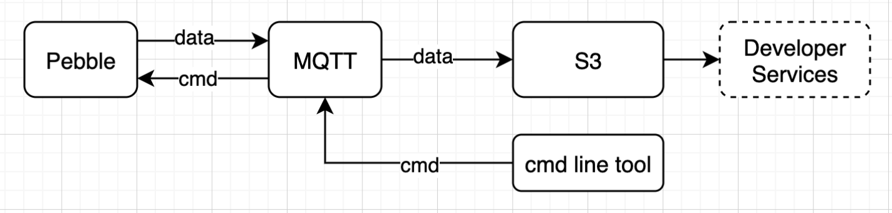

## Quick Start
### Prerequisites
#### 0. Find a Linux Machine
To run the backend services, you will need a machine with least 2CPU and 4GB memory and runs Debian or Ubuntu. You could grab one from AWS or GCP; if you want to use your local PC/laptop, make sure it has a public IP (e.g., using ngrok), where pebble can send data to.

#### 1. [Install Docker CE](https://docs.docker.com/engine/installation/)

#### 2. [Install Docker Compose](https://docs.docker.com/compose/install/)

#### 3. (Optional) Add Current User to `Docker` Group

Adding the the current user group (e.g., `ubuntu`) to the `docker` group will allow you to use `docker` command without `sudo`.

`sudo groupadd docker; sudo usermod -aG docker $USER`

To make sure it works
```
cat /etc/group | grep docker

```
should return something like `docker:x:999:ubuntu`.

#### 4. Install SDK for MQTT

```
sudo apt-get update
sudo apt install python3-pip
pip3 install AWSIoTPythonSDK
```

#### 5. Make `git clone` Work
Config your `git`, e.g., with the correct SSH key, to make sure `git clone` will work properly.

### Start Pebble Backend

1. Run `./setup-dev.sh` to download all docker images and code repos first and then run `./start-dev.sh` to start the service. After that make sure everything is up and running by `docker ps` and you should see something like below:
```
:~/pebble-backend-master$ docker ps
CONTAINER ID        IMAGE                            COMMAND                  CREATED             STATUS              PORTS                                  
                                  NAMES
116b6aa864c8        minio/minio:latest               "/usr/bin/docker-ent…"   14 minutes ago      Up 14 minutes       0.0.0.0:9000->9000/tcp                 
                                  docker-compose_minio_1
a651095d850d        iotex-hmq:local                  "/hmq -c /config/con…"   14 minutes ago      Up 14 minutes       0.0.0.0:1884->1883/tcp                 
                                  docker-compose_hmq_1
a67d65f71c76        thingsboard/tb-gateway:latest    "/bin/sh ./start-gat…"   14 minutes ago      Up 14 minutes                                              
                                  docker-compose_thingsboard-gateway_1
9ce61f993ca5        iotex-blockchain-data:local      "pebble-data-contain…"   14 minutes ago      Up 14 minutes                                              
                                  docker-compose_api-server_1
cbb292f45664        thingsboard/tb-postgres:latest   "start-tb.sh"            14 minutes ago      Up 14 minutes       0.0.0.0:1883->1883/tcp, 0.0.0.0:5683->5
683/udp, 0.0.0.0:8080->9090/tcp   docker-compose_thingsboard_1
```

2. Make sure port `1884` is exposed for MQTT and port `8080` is exposed for Thingsboard, e.g., `telnet 1.2.3.4 1884` and `telnet 1.2.3.4 8080`.

3. Login in Thingsboard via http://1.2.3.4:8080/ with the default username/password: tenant@thingsboard.org/tenant and change your password after login.

4. Create Thingsboard Gateway as below
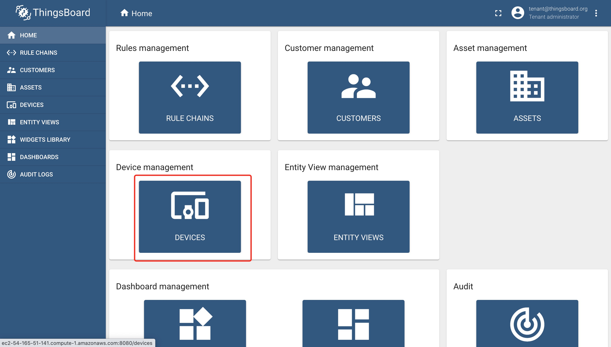

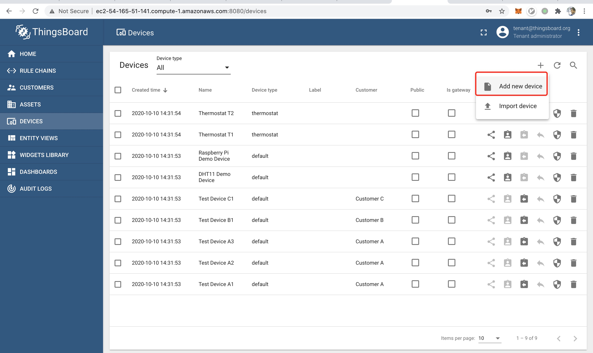

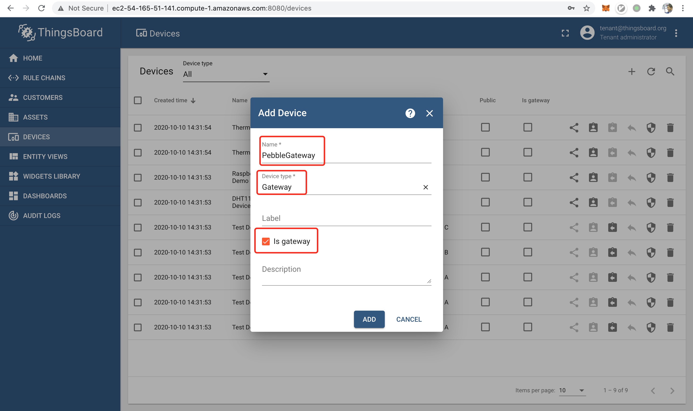

5. Coopy the `Access Token` like below and modify the config of the gateway:

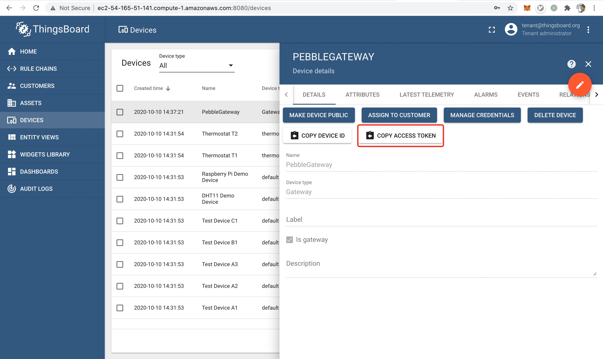

```
sudo vim ~/pebble-var/conf/tb-gateway/conf/tb_gateway.yaml
```
Replace accessToken: xxxxxxxxxxxxx with the newly copied token
```
thingsboard:
  host: thingsboard
  port: 1883
  security:
    accessToken: xxxxxxxxxxxxx
storage:
  type: memory
  read_records_count: 100
  max_records_count: 100000

connectors:
  - name: MQTT Broker Connector
    type: mqtt
    configuration: mqtt.json
```

6. Restart the gateway service
```
docker restart docker-compose_thingsboard-gateway_1
```

7. Congrats! You already setup the pebble backend which is ready to receive pebble data!

## Visualize Pebble Data on Thingsboard
To visualize the data, the easiest way is
1. generate mock data and inject it to pebble backend
2. use the predefined dashboard to see the data

### 1. Inject Mock Data
Run the following on the same machine that runs the backend:
```
cd scripts
./mock-dev.sh
```
This script continously produce data points according to pebble spec and inject it into the local `1884` port. If you run into an issue, e.g., not see data flow in, you can run directly `python3 ./run-dev.py -e localhost -p 1884 -id device/pebble-1/data -pf ../data/sample.txt` to debug.

### 2. Import Predefined Dashboard
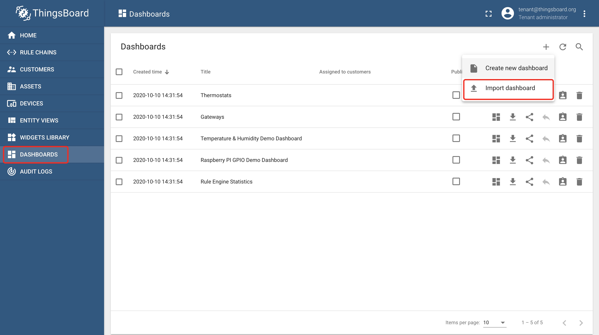

drop example/dashboard/pebble_1.json to the box

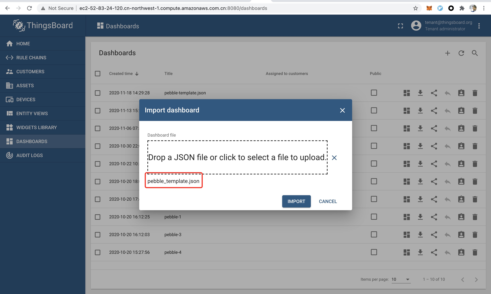

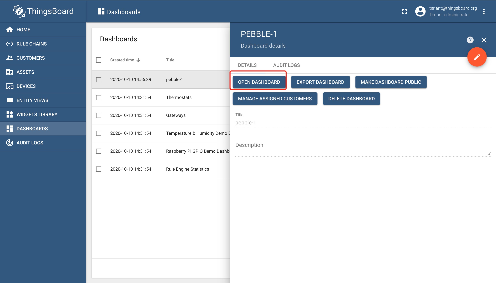

Modify
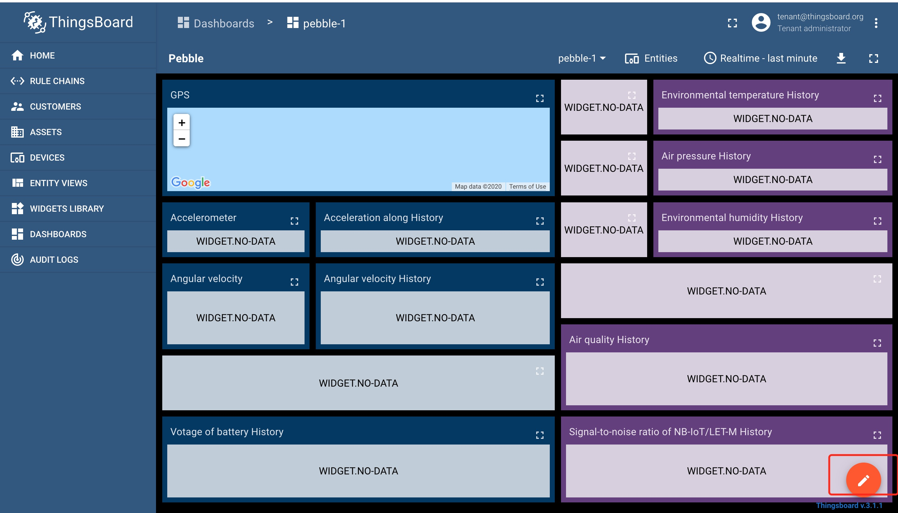

Set to pebble-1
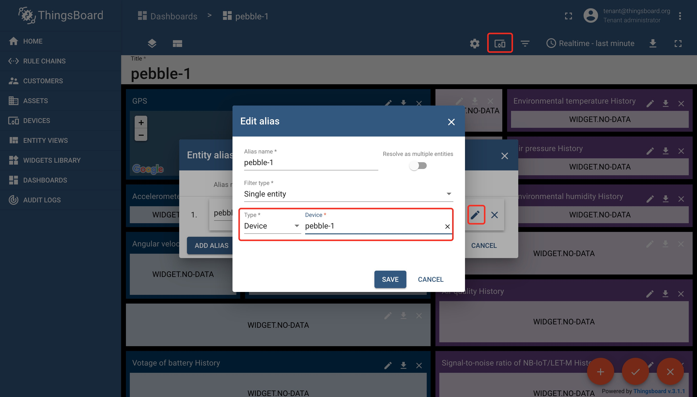

## Other Tools
### Mock tool
- scripts/mock.sh: Start 50 clients to send messages to mqtt in the background.
- scripts/stop-mock.sh: Stop all running clients.

#### Run With More Options
run.py is a command to start a client, accepting parameters:
```
-e | --endpoint: Your AWS IoT custom endpoint
-r | --rootCA: Root CA file path
-c | --cert: Certificate file path
-k | --key: Private key file path
-p | --port: Port number override
-w | --websocket: Use MQTT over WebSocket
-id | --clientId: Targeted client id
-pb | --publish: Publish payload
-pf | --publish-file: Publish payload with file
```

run.py will send a message every 30 seconds

The message will be stored in the 'pebble-store' bucket in s3, like:
```
pebble-store/pebble-(1,2,3...50)/<timestamp>
```

### Import Predifined RULE CHAIN
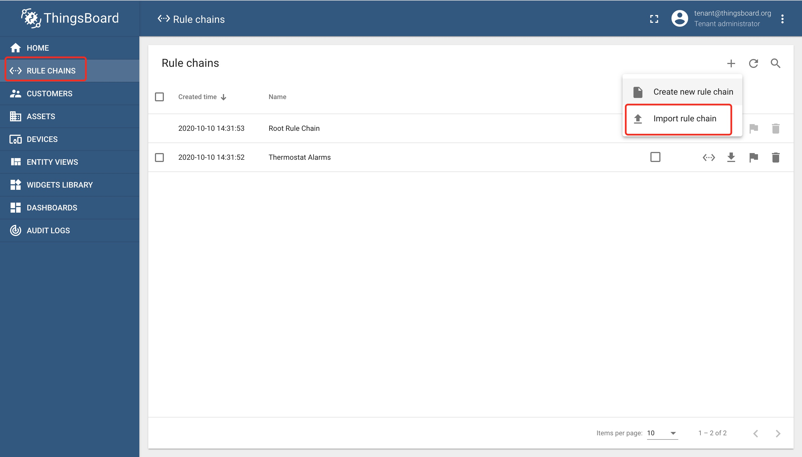

drop example/thingsboard-rule/pebble.json to the box
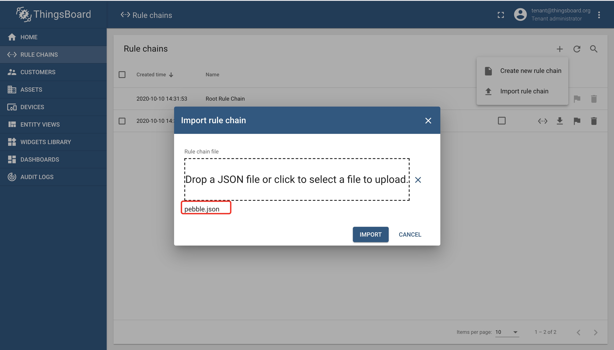

Apply
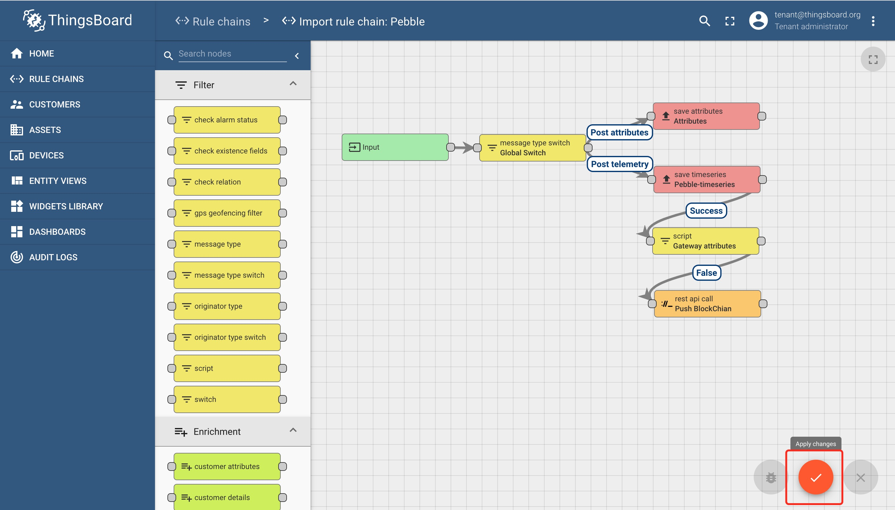

Back to here and make it to the root
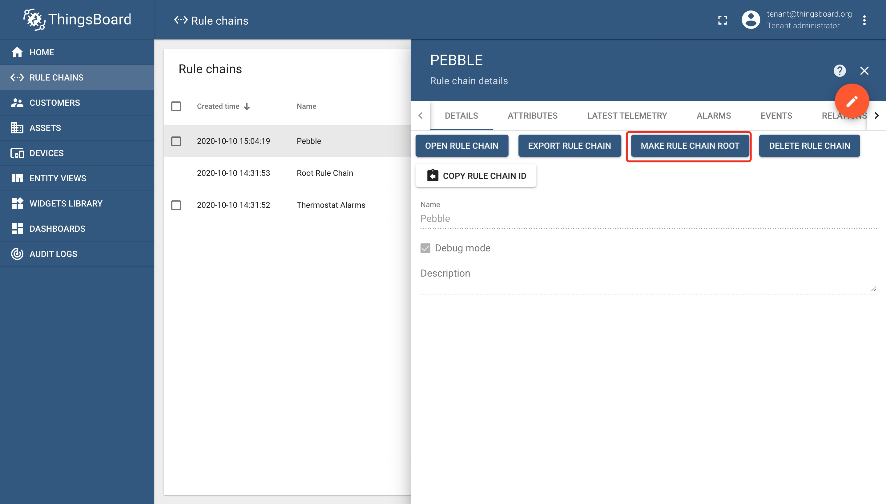

## Setup Pebble Backend on AWS
https://iotex.larksuite.com/docs/docuswsC2fyQNSH4fwdahKka5Rr#hbyvmo

### Our data flow is
```
Device(SDK) --> aws iot --> s3
                       |
                       + --> thingsboard gateway --> thingsboard
                                                         |
                                                         +--> iotex blockchain
```


### Start
Make directories for start thingsboard and thingsboard gateway
```
mkdir ~/{data,logs}
mkdir -p ~/conf/keys
mdkir -p ~/conf/tb-gateway/{conf,extensions,logs}
```

Use the file configs/docker-compose/docker-compose.yml
```
cd configs/docker-compose/
docker-compose up -d
```

### Configure gateway
Login Thingsboard as tenant and create a gateway

Copy it &lsquo;s token

Set it to configs/tb-gateway/tb_gateway.yaml:
```
thingsboard.security.accessToken=<token>
```

Restart the thingsboard gateway
```
cd configs/docker-compose/
docker-compose restart
```

(Optional)

After startup, some default configuration files will be generated

If you need to modify more, you can refer to the [official document](https://thingsboard.io/docs/iot-gateway/configuration/)

## Integration with IoTeX blockchain
In Thingsboard, we use "rule of thingsboard" to send messages to the blockchain.
As shown

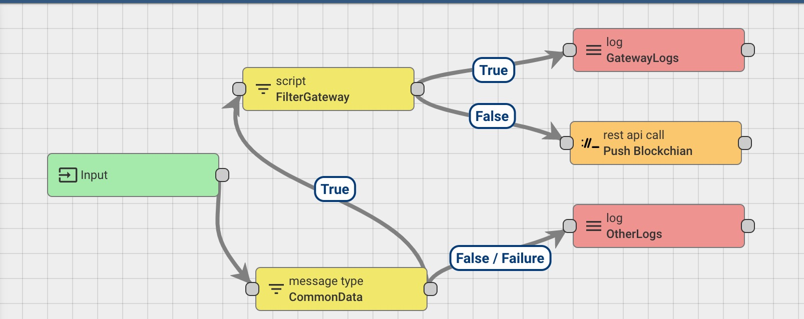

- First, switch with "message type":

A message enters the chain from "input" and then into the node named "message type CommonData". If the "message type" is "Post Telemetry", it will be transmitted to the "Script FilterGateway" node. The "post telemetry" type includes device telemetry data.

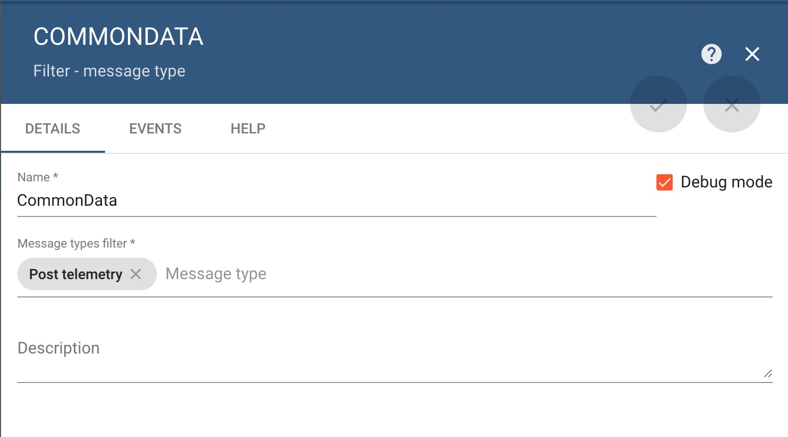

- Then, swicth with device type:

A message enters the "script FilterGateway" from "message type CommonData". If the "deviceType" is not "Gateway"(Because the data entering thingsboard comes through thingsboard gateway, there is data of type "Gateway", which needs to be filtered out), it will be transmitted to the "rest api call Push Blockchain" node. The "not Gateway" and the "post telemetry" are equivalent to all devices.

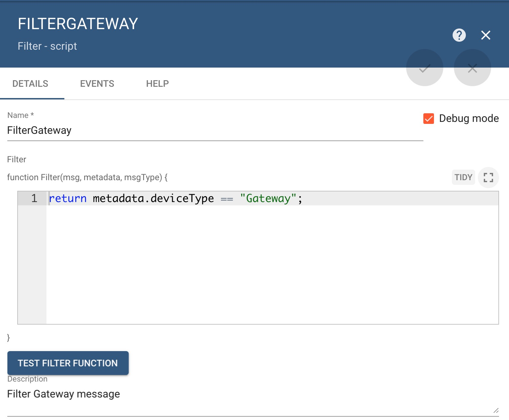

- Last, Push data to the blockchain:
A message enters the "rest api call Push Blockchain" from upstream. There are all of devices' post telemetries in the node.Then it will use the url to call the api server, and the variable "deviceType" is a metadata field. It comes from the configuration of Thingsboard Gateway.

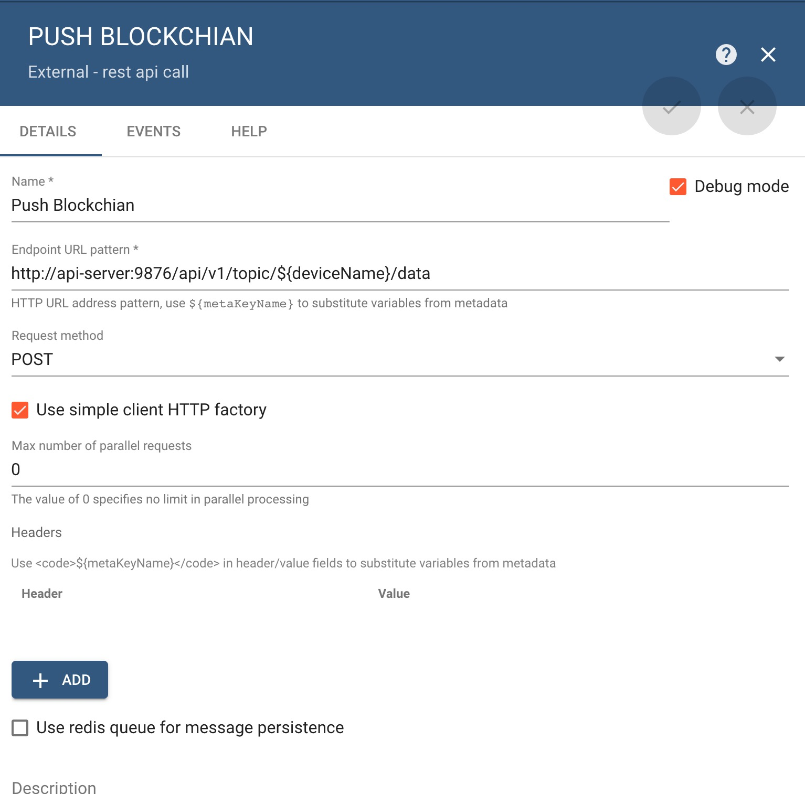

The Api server is a proxy for rpc-call the IOTEX server. Finally put the data on the blockchain.

The request:

```
HTTP 1.1 POST /api/v1/topic/{topic}/data
body is json containing device telemetry data
```

will be sent to a deployed contract address, and then executed by the contract to do more...
The important code is [iotexproject/pebble-data-container](https://github.com/iotexproject/pebble-data-container/blob/master/blockchain/put.go#L68)
