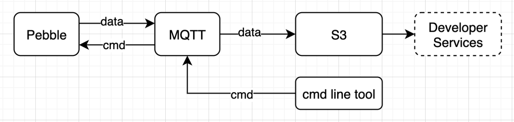

# pebble-backend



## Quick Start
### Prerequisites
####
```
sudo apt-get update
sudo apt install python3-pip
```

#### Install SDK for MQTT
```
pip3 install AWSIoTPythonSDK
```

#### A Simple Run
- start.sh   Start 50 clients to send messages to mqtt in the background.
- stop.sh    Stop all running clients.

#### Run With More Options
run.py is a command to start a client, accepting parameters:
```
-e | --endpoint: Your AWS IoT custom endpoint
-r | --rootCA: Root CA file path
-c | --cert: Certificate file path
-k | --key: Private key file path
-p | --port: Port number override
-w | --websocket: Use MQTT over WebSocket
-id | --clientId: Targeted client id
-pb | --publish: Publish payload
-pf | --publish-file: Publish payload with file
```

run.py will send a message every 30 seconds

The message will be stored in the 'pebble-store' bucket in s3, like:
```
pebble-store/pebble-(1,2,3...50)/<timestamp>
```

## Integration with Thingsboard
The [Architecture](https://thingsboard.io/images/gateway/python-gateway-animd-ff.svg)
### Our data flow is
```
Device(SDK) --> aws iot --> s3
                       |
                       + --> thingsboard gateway --> thingsboard
```

### Prerequisites
- [Install Docker CE](https://docs.docker.com/engine/installation/)
- [Install Docker Compose](https://docs.docker.com/compose/install/)

### Start
Make directories for start thingsboard and thingsboard gateway
```
mkdir ~/{data,logs}
mkdir -p ~/conf/keys
mdkir -p ~/conf/tb-gateway/{conf,extensions,logs}
```

Use the file configs/docker-compose/docker-compose.yml
```
cd configs/docker-compose/
docker-compose up -d
```

### Configure gateway
Login Thingsboard as tenant and create a gateway

Copy it &lsquo;s token

Set it to configs/tb-gateway/tb_gateway.yaml:
```
thingsboard.security.accessToken=<token>
```

Restart the thingsboard gateway
```
cd configs/docker-compose/
docker-compose restart
```

(Optional)

After startup, some default configuration files will be generated

If you need to modify more, you can refer to the [official document](https://thingsboard.io/docs/iot-gateway/configuration/)

## Integration with IoTeX blockchain
TBD
